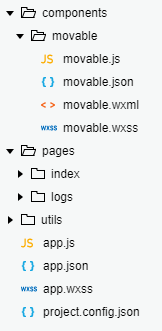
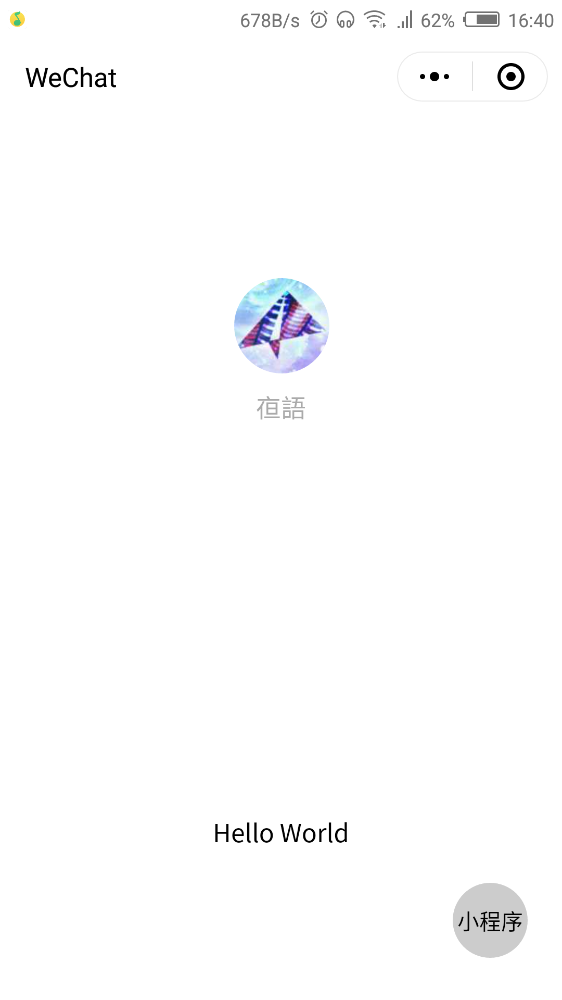
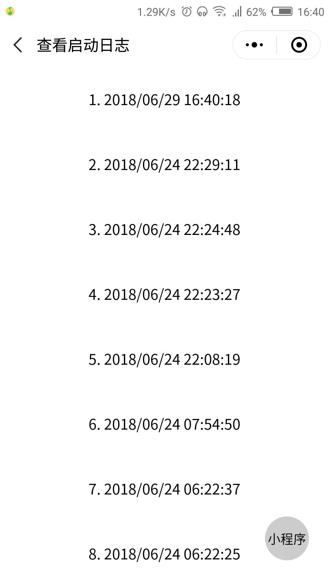

# 小程序 拖拽组件

### 微信开发工具导入项目

```console
  新建项目 -> 导入src文件 -> 预览效果
``` 

### 截图预览

<div align=center>
  
  
  
</div>

### 组件代码

> movable.wxml

``` html
  <movable-area class='movable-box'>
    <slot/>
    <movable-view
      class='movable-btn'
      x='{{x}}'
      y='{{y}}'
      direction='all'
      bindtap='goEvt'>
      <navigator
        target='miniProgram'
        open-type='navigate'
        app-id=''
        path=''
        extra-data=''
        version='release'>小程序</navigator>
    </movable-view>
  </movable-area>
```

> movable.wxss

``` css
  .movable-box {
    width: 100vw;
    height: 100vh;
  }
  .movable-btn {
    position: fixed;
    width: 100rpx;
    height: 100rpx;
    line-height: 100rpx;
    text-align: center;
    background: #ccc;
    border-radius: 50%;
    font-size: 30rpx;
  }
```

> movable.js

``` js
  let {
    windowWidth,
    windowHeight
  } = wx.getSystemInfoSync()

  Component({
    properties: {
      x: {
        type: Number,
        value: windowWidth - 70
      },
      y: {
        type: Number,
        value: windowHeight - 75
      }
    }
  })
```

> movable.json

``` json
  {
    "component": true
  }
```

### 如有商业想法，可以加我微信(15012851811)，加我请注明信息

### 如果觉得不错，请动动您的小拇指，star一下
